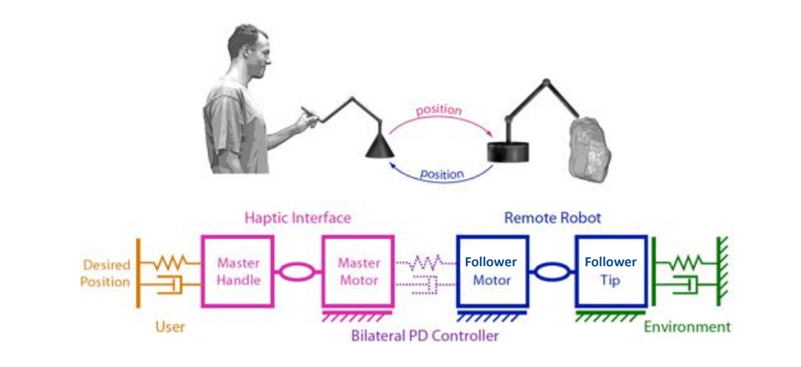

# Bilateral__Teleoperation
This performs teleoperation between two remote hapkit devices to get haptic feedback, communicating thorugh I2C protocol  and follows bilaterial teleoperation control algorithm:

This shows the output waveform between the two devices:
.png)
